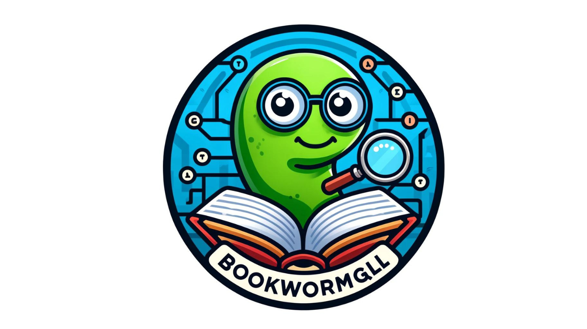

# BookWormGQL : A Book Search Engine 

##

## Table of Contents
- [Description](#description)
- [Built With](#built-with)
- [Features](#features)

- [Contact](#contact)
- [License](#license)

## Description
BookWormGQL is a Search Engine Tool designed to allow users to search for books using GooglesBookAPI, Users can create personal Book lists and execute certain actions related to the their Books. Using Apollo Client and GraphQL to optimize network requests by reducing the bandwidth by allowing users to query exactly the data they need , which over all should improve the apps performance.

## Built With
**Node.JS | Express | MongoDB | Mongoose | Apollo | GraphQL**

## Features

**User Authentication:**

Secure Sign-In/Sign-Up: Users can easily create an account and log in securely to access personalized features. The application ensures the safety of user credentials by using JWT for authentication.

Token-Based Session Management: Sessions are managed using tokens stored in local storage, allowing users to stay logged in across sessions until they choose to log out.
Book Search:

**Integrated Book Search Interface:** 

Users have access to a convenient book search feature powered by a third-party API, such as the Google Books API. This enables users to find detailed information about a wide variety of books.

*Search Result Display:* 

The search interface displays relevant books along with key details like title, authors, descriptions, and cover images, making it easy for users to browse through search results.
Personal Book Lists:

*Save Books to Personal List:* 
Users can save interesting books to their personal list for future reference, allowing them to create a customized reading list.

*Manage Saved Books:* 

The application provides users with the ability to view and manage their saved books, including the option to remove books from the list as their preferences or reading goals change.

**Apollo Client and GraphQL:**

Real-time Data Interaction: By leveraging Apollo Client and GraphQL, the application enables efficient fetching and manipulation of data, ensuring a seamless and responsive user experience.

Optimized Network Requests: The use of GraphQL significantly reduces bandwidth usage by allowing users to request only the data they need, thereby enhancing the performance of the application.
Responsive and Intuitive UI:

*User-Friendly Design:* 

The application features a clean and intuitive interface, making it effortless for users to navigate through various features, from conducting book searches to managing their saved lists.

*Responsive Layout:* Designed with responsiveness in mind, the app ensures a consistent and enjoyable experience across different devices and screen sizes.

## Contact

- GitHub: [Maximilian93B](https://github.com/Maximilian93B)
- Email: [max.md.bosch@gmail.com](mailto:max.md.bosch@gmail.com)

## License
This project is licensed under the MIT license.

## Notes
Thanks for taking the time use and review BookWormGQL.

Happy Coding !!